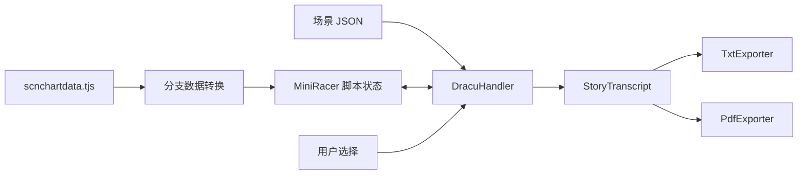

# 架构与数据模型

## 数据流与职责

Dracu 当前的数据流如下：



- **config** 描述输入位置和运行开关，由 Pydantic 定义。
- **handler** 适配游戏的数据结构，执行脚本并决定实际经过哪些场景。
- **model** 保存已经经过的章节与全部可用语言的台词。
- **exporter** 选择目标语言，格式化内容并生成文件。

一次运行产生一份记录，exporter 可以读取同一份记录多次。导出不重新执行脚本，不重新要求用户选择路线。

尚未迁移的四个 handler 仍然将遍历和文件生成放在一起。旧 PDF 接口及其配置继续保留。

## 概念对应

| 概念 | 当前含义 |
| --- | --- |
| 脚本文件、`storage` | 例如 `example.ks`，对应一个 JSON 文件 |
| 场景、`scene` | 文件内按 `label` 标识的控制流块 |
| 位置 | `storage` 与 `target` 标签组合 |
| 章节、`Chapter` | 本次流程的一次脚本文件加载 |
| 台词、`DialogueEntry` | 一条正文及其各语言版本，也可以是旁白 |
| 剧情记录、`StoryTranscript` | 一次流程实际收集的章节和正文 |

同一文件内跳标签不会新增章节；离开文件后再次进入，会新增一个同名 `storage` 的章节。章节按访问顺序保存，允许空章节和重复文件名。

当前模型只保存正文，不保存选项列表、用户选择记录、完整分支图或脚本状态快照。

## 数据模型

定义见 [models/story_transcript.py](../models/story_transcript.py)。

| 类型 | 字段 | 语义 |
| --- | --- | --- |
| `DialogueTranslation` | `speaker_alias: str` | 该语言原始别名，允许为空 |
| | `text: str` | 原始正文，保留换行和空字符串 |
| `DialogueEntry` | `original_speaker: str` | 原始说话人，允许为空 |
| | `translations: dict[str, DialogueTranslation]` | 此条台词实际提供的语言版本 |
| `Chapter` | `storage: str` | 来源脚本名称 |
| | `entries: list[DialogueEntry]` | 按经过顺序保存的正文 |
| `StoryTranscript` | `supported_languages: list[str]` | 本次记录包含的语言，按 `jp/en/sc/tc` 排列 |
| | `chapters: list[Chapter]` | 按文件访问顺序保存的章节 |

这些类型是普通 dataclass。列表采用 `default_factory=list`，各个对象拥有独立的列表；模型本身可变，handler 在运行过程中追加内容。

`add_chapter(storage)` 会追加并返回一个新章节。模型没有内置语言回退、格式化或文件输出方法。

## 多语言语义

Dracu 的每条原始文本从 `text[0]` 取得原始说话人，从 `text[1]` 取得语言数组。数组依次对应 `jp/en/sc/tc`；语言条目中的前两个值为别名和正文。

示例：

```python
from models.story_transcript import (
    DialogueEntry, DialogueTranslation, StoryTranscript,
)


transcript = StoryTranscript(supported_languages=["jp", "en", "sc", "tc"])
chapter = transcript.add_chapter("example.ks")
chapter.entries.append(DialogueEntry(
    original_speaker="美羽",
    translations={
        "jp": DialogueTranslation(speaker_alias="", text="こんにちは。"),
        "en": DialogueTranslation(speaker_alias="Miu", text="Hello."),
        "sc": DialogueTranslation(speaker_alias="", text="你好。"),
        "tc": DialogueTranslation(speaker_alias="美羽", text="你好。"),
    },
))
chapter.entries.append(DialogueEntry(
    original_speaker="",
    translations={"jp": DialogueTranslation(speaker_alias="", text="日文旁白。")},
))
```

`supported_languages` 表示整份记录包含哪些语言，并不保证每条台词都有这些语言。上例第二条仍然只有日文。

Dracu 以 `jp` 初始化语言集合，收集台词时合并实际出现的键，结束后按固定顺序生成列表。因此仅日语流程声明 `["jp"]`；混合四语言流程声明四种语言；没有收集任何台词时仍声明 `["jp"]`。

别名为空时保存空字符串。导出时根据所选翻译计算 `speaker_alias or original_speaker`；两者都为空时显示为旁白。详情见 [Exporters 实现](exporters.md)。

记录中的语言条目不会因为导出回退而被补写。当前也不保存原始语言条目的长度等额外字段。

## Handler 注册与调用

`handlers` 导入时会加载目录内除 `__init__.py` 外的 Python 模块。具体实现通过装饰器写入 `Handlers`：

```python
@registry(name="dracu", description="Dracu-Riot! Steam版", config_class=DracuConfig)
class DracuHandler(BaseHandler):
    ...
```

`HandlerMeta` 保存 `name`、`description`、`clazz` 和 `build_config`。`build_config` 是配置类，调用后得到配置实例；`clazz` 是 handler 类，调用后得到 handler 实例。

`BaseHandler.handle(config)` 先调用 `config.check_valid()`，再返回 `_handle(config)` 的结果。当前 Dracu 返回 `StoryTranscript`，其他四个 handler 返回 `None`。

Exporter 采用相同的注册思路，元数据只包含名称、描述和实现类。当前没有 exporter 配置类。新增组件方式见 [开发规范](development.md)。
